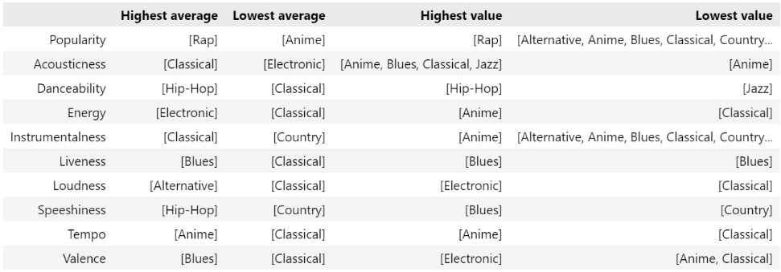
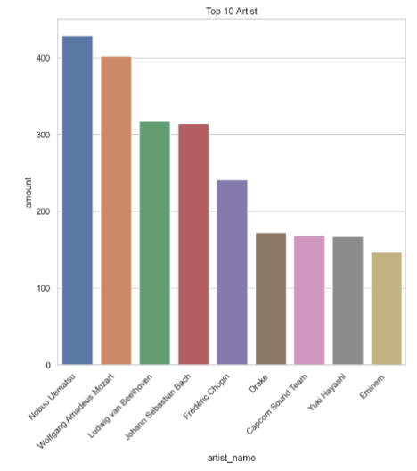
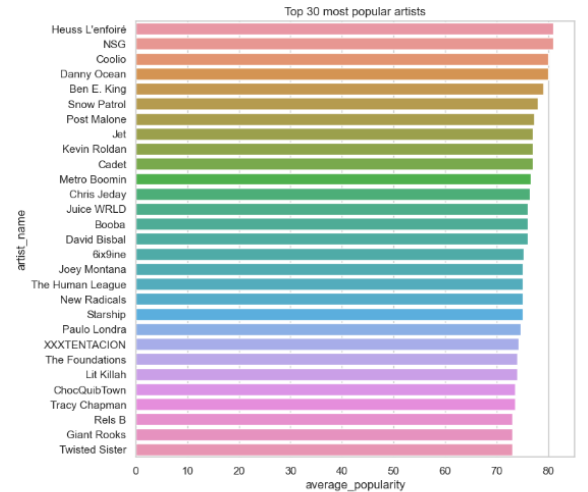

# Exploratory Data Analysis con Python - Music Genre
En el presente trabajo a partir de un data set sobre géneros de música, obtenido de la plataforma Kaggle, se analizará la data que presenta para realizar conclusiones y hacerla lo suficientemente robusta para una posterior modelización. El problema a resolver es encontrar qué características diferentes presentan las canciones según el género. El análisis fue realizado en Visual Studio mediante una notebook (archivo .ipynb).

## Introducción
En primer lugar se importaron las librerías necesarias: Pandas, Seaborn y Matplotlib. Luego se cargó el data set desde el formato CSV (comma separated values) a un pandas data frame. Mediante un shape se obtienen las dimensiones del data frame, y con las funciones head() y tail() las primeras y últimas filas del data frame, respectivamente. A partir de esto se puede observar que el data set está compuesto por 50005 filas y 18 columnas. Los nombres de las columnas y las descripciones y valores esperados para cada una de ellas son las siguientes: 
- instance_id: ID de la canción.  
- artist_name: nombre del artista.
- track_name: nombre de la canción.
- popularity: puntuación de popularidad de la canción, toma valores entre 0-100. 
- acousticness: toma valores entre 0,0 y 1,0 a partir de si la canción es acústica, un valor de 1,0 representa una canción muy acústica.   
- danceability: toma valores entre 0,0 y 1,0 a partir de qué tan bailable es la canción en función de una combinación de elementos musicales que incluyen tempo, estabilidad el ritmo, fuerza del ritmo y regularidad general. Un valor de 0,0 significa que la canción es poco bailable y un valor de 1,0 la canción es muy bailable.
duration_ms: duración de la canción en milisegundos. 
- energy: toma valores entre 0,0 y 1,0 y representa una medida de la intensidad y actividad. Por lo general las pistas enérgicas se sienten ráìdas, fuertes y ruidosas. Por ejemplo, el death metal tiene mucha energía (valor cercano a 1,0), mientras que un Bach prelude presenta baja energía (valor cercano a 0,0). Las características de esta variable son el rango dinámico, el volumen percibido, el timbre, la tasa de inicio y la entropía en general.  
- intrumentalness: toma valores entre 0,0 y 1,0  en función de si la canción contiene voces o no. Los  sonidos como “Ooh” y “aah” se tratan como instrumentales en este contexto. Las canciones de rap o palabras habladas son vocales. Cuando más instrumental sea más cerca estará el valor de 1,0 y mayor probabilidad habrá de que la canción no tenga contenido vocal.   
key: Es el tono en el que se encuenta la canción. Las keys posibles existentes son las que se presentan en la siguiente imagen y están ligadas a las notas musicales.

- liveness: toma valores entre 1,0 y 0,0 en función de la presencia de audiencia en la grabación. Los valores con liveness más altos tienen mayor probabilidad de que la canción se haya interpretado en vivo.  
- loudness: El volumen de una canción se mide en decibelios (dB). Los valores típicos oscilan entre -60dB y 0dB.
- mode: Indica la modalidad (mayor  o minor) de una canción, esta escala surge de su contenido melódico. 
- speechiness: toma valores entre 0,0 y 1,0 en función de la presencia de palabras habladas en una canción. Cuanto más presencia de voz haya en una canción (por ejemplo como sucede en audiolibros o poesías) más cerca de 1,0 estará. Los valores superiores a 0,66 tienen mayor probabilidad de que  la canción está compuesta mayoritariamente por palabras; para valores entre 0,33 y 0,66 las canciones están compuestas tanto por voz, ya sea en secciones como en la música rap. Y las canciones con valores menores a 0,33 probablemente representen mayoritariamente música. 
- tempo: es el tempo general estimado para una canción en pulsaciones por minuto (BPM). Es la velocidad o ritmo de una canción dada.
- obtained_date: fecha en que se registró la canción en el data set. 
- valence: toma valores entre 0,0 y 1,0 en función de la posi ji tividad musical transmitida en una canción. Las canciones con valores de valence altos suenan más positivas (por ejemplo, felices, alegres, eufóricas), mientras que las canciones con valence bajo suenan más negativas (por ejemplo tristes, deprimidas, enfadadas). 
- music_genre: género musical considerado para la canción.  

## Análisis
El siguiente paso consistió en aplicar la función describe() para obtener diferentes estadísticos de las columnas numéricas como la cantidad, la media, el desvío estándar el valor mínimo, el cuartil 0.25, 0.50, 0.75 y el valor máximo. Por otro lado los estadísticos obtenidos de aquellas variables consideradas como object son la cantidad, la cantidad de valores únicos, top (el  que se repite más veces) y la frecuencia en la que este valor se repite. Posteriormente se analizará cada una de las variables.
Luego se realizó una limpieza del data set en donde se eliminaron los registros duplicados, eliminando en total cuatro registros (0,008% del total). En estos registros todas las variables  presentaban un valor NaN (not a number), considerándolos como missing values. Posteriormente se eliminaron aquellos registros en donde se detectaron missing values, siendo en este caso 1. Cabe destacar que en esta situación particular si se hubieran eliminado los missing values antes de eliminar los duplicados no hubiera sido requerida esta segunda acción dado que los duplicados solo estaban conformados por missing values.
Finalmente se convirtieron todas las variables object a minúscula para verificar de que no hubieran registros duplicados estando algunos en mayúscula y otros en minúscula. Se corrobora así que no hay registros duplicados con distintos tamaño de letra. De esta manera el data set resultante está compuesto por 50000 filas y 18 columnas      
Realizando un heat map entre las variables numéricas (consideradas como float) se observa que el que presenta mayor correlación positiva es entre energy y loudness con un valor de coeficiente de correlación de 0,84 y el segundo con mayor correlación positiva es entre valence y danceability con un coeficiente de 0,43. Por otro lado el que presenta mayor correlación negativa es entre energy y acousticness con un coeficiente de -0,73 y el segundo es entre instrumentalness y loudness con un coeficiente de -0,53. 
 
Continuando con los géneros musicales, agrupando por género se observa que la cantidad de canciones que presenta cada género es la misma (5000 por género), por lo tanto la información está balanceada por género, estos son: Alternative, Anime, Blues, Classical, Country, Electronic, Hip-Hop, Jazz, Rap y Rock. 
 
Para la variable artist_name se observa que el valor más repetido es “empty_file” que representa el 4.978% del data set. Dado que la variable no se considera relevante para encontrar las características por género se dejaran estos registros.
 
Analizando el promedio de popularidad por artista (sin considerar los registros “empty_field”) se analizaron aquellos que tienen promedio de popularidad cero para entender si es porque el promedio es cero o si efectivamente tienen una popularidad nula. Filtrando dichos artistas efectivamente presentan una popularidad de 0. 
 
Posteriormente se analizaron aquellos registros con artist_name y track_name duplicados, se observa que estos representan el 14,946% del total del data set. Sin embargo al analizar los artist_name, track_name y music_genre duplicados, se observa que solo representan el 0,024% concluyéndose así que una canción puede pertenecer a más de un género musical.
 
Continuando con la variable key se observa que todos los valores que se presentan en el dat set  son keys musicales reales coincidentes con las mencionadas anteriormente. 
 
Pasando a la variable duration_ms se observa que presenta valores negativos, lo cual es ilógico porque un tiempo no puede tomar valores menores a cero. La cantidad de registros con valores negativos representan un 9,877% del total del data set, se puede considerar que esta cantidad es considerablemente grande como para eliminarlos. Analizando los valores negativos se observa que solo toman el valor de -1. Por lo tanto se los reemplazará por otro valor positivo. Estos valores se los puede reemplazar por la media, moda, mediana o incluso se puede realizar una aproximación más compleja utilizando algún algoritmo más específico o aplicando modelos de machine learning. En este caso se lo reemplazará por la media de valores positivos de duration_ms correspondiente al valor de 245507,92 milisegundos. 
 
Continuando con la variable tempo, se observa que el valor más repetido es “?” lo cual no tiene sentido teniendo en cuenta el tiempo toma valores  numéricos medidos en BPM. La cantidad de registros con valores iguales a “?” representan el 9,96% del total del data set, se puede considerar que esta cantidad es considerablemente grande como para eliminarlos. Se realizó un heat map para encontrar alguna relación entre los valores de tempo y las demás variables numéricos y así poder aplicar una aproximación más específica para reemplazar los valores “?”, pero no se encontró ninguna correlación significativa. Por lo tanto, al igual aplicando el mismo procedimiento que para duration_ms, se reemplazó este valor por la media de valores numéricos de tempo correspondiente a 119.95 BPM. 
 
Analizando la variable mode se observa que todos los valores que se presentan en el dat set  son modes reales coincidentes con las mencionadas anteriormente. Cabe destacar que se tuvo en cuenta que la sintaxis de cada categoría de mode sea la misma, es decir, “Major” y “Minor” y no esten escritos de forma diferente como por ejemplo  algunos en “MINOR” o “minor”, ya que el código puede interpretarlo como dos categorías diferentes.
 
Pasando a la variable obtained_date,  los valores que toma son 1-Apr, 2-Apr, 3-Apr, 4-Apr, 5-Apr y 0/4, considerando a este último valor un error. De este valor se puede concluir que todos los datos fueron cargados en el data set en 5 fechas distintas, pero dado que sólo representa la fecha en que fueron cargados los registros y no tiene incidencia sobre la canción en sí, todo el data set  fue eliminado. 
 
Se observa que la variable loudness presenta valores mayor a 0 dB contradiciéndose con la hipótesis planteada anteriormente. La cantidad de registros con valores de loudness positivos representan el 0,094% del total del data set, se puede considerar que esta cantidad no es considerablemente significativa y por lo tanto se eliminaron dichos registros.
 
Finalizando con el análisis de distribución de las demás variables se observa que aquellas que deben tomar entre 0,0 y 1,0 cumplen con lo planteado, esto también se puede corroborar mediante los valores máximos y mínimos presente en la tabla que se obtiene al aplicar la función describe() sobre el data frame.
 
## Conclusiones
 
Inicialmente se notó que el data set estaba compuesto por cantidades iguales de registros por cada género musical (cantidades que luego del análisis anteriormente explicado sufrieron pequeñas variaciones). Es por esto que se analizaran las características de cada género musical. Para cada género se tomará el promedio, el valor máximo y mínimo en cada variable. Las conclusiones obtenidas son las siguientes:
- El de mayor popularidad promedio es el género Rap y el de menor popularidad promedio es el género Anime. El que alcanza el mayor valor de popularidad es Rap y el valor minimo de popularidad (cero) esta compartido por todos los géneros excepto Hip-Hop y Rap.
- El de mayor acousticness promedio es el género Classical y el de menor acousticness promedio es el género Electronic. Los que alcanzar el mayor valor de acousticness son Anime, Blues, Classical y Jazz; y el valor minimo de acousticness esta alcanzado por el género Anime.
- El de mayor danceability promedio es el género Hip-Hop y el de menor danceability promedio es el género Classical. El que alcanza el mayor valor de danceability es Hip-Hop; y el valor minimo de danceability esta alcanzado por el género Jazz.
- El de mayor energy promedio es el género Electronic y el de menor energy promedio es el género Classical. El que alcanza el mayor valor de energy es Anime; y el valor minimo de energy esta alcanzado por el género Classical.
- El de mayor instrumentalness promedio es el género Classical y el de menor instrumentalness promedio es el género Country. El que alcanza el mayor valor de instrumentalness es Anime; y el valor mínimo de instrumentalness está alcanzado por todos los géneros.
- No se osberva una preferencia de key por género.
- El de mayor liveness promedio es el género Blues y el de menor liveness promedio es el género Classical. El que alcanza el mayor valor de liveness es Blues; y el valor minimo de liveness esta alcanzado por el género Blues.
- El de mayor loudness promedio es el género Classical y el de menor loudness promedio es el género Alternative. El que alcanza el mayor valor de loudness es Classical; y el valor minimo de loudness esta alcanzado por el género Electronic.
- Se observa que para el género Country, Rock, Blues y Classical el mode mayoritario es el Major, pero en general todos lso géneros tienden a tener canciones donde predomina el modo Major por sobre el modo Minor.
- El de mayor speechiness promedio es el género Hip-Hop y el de menor speechiness promedio es el género Country. El que alcanza el mayor valor de speechiness es Blues; y el valor minimo de speechiness esta alcanzado por el género Country.
- El de mayor tempo promedio es el género Anime y el de menor tempo promedio es el género Classical. El que alcanza el mayor valor de tempo es Anime; y el valor minimo de tempo esta alcanzado por el género Classical.
- El de mayor valence promedio es el género Blues y el de menor valence promedio es el género Classical. El que alcanza el mayor valor de valence es Electronic; y el valor minimo de valence esta alcanzado por los géneros Classical y Anime.
Dichas conclusiones pueden resumirse en el siguiente DataFrame.

Posterior a este análisis se peude utilizar el data set para diferentes objetivos, por ejemplo predecir el género a partir de la información de diferentes variables. Las conclusiones obtenidas nos permiten validar los resultados que se puedan llegar a obtener. 

## Conclusiones adicionales
Como conclusión adicional se graficaron los primeros 10 artistas con mayor cantidad de canciones en el data set:

Adicionalmente se graficaron los primeros 30 artistas con mayor popularidad promedio:

